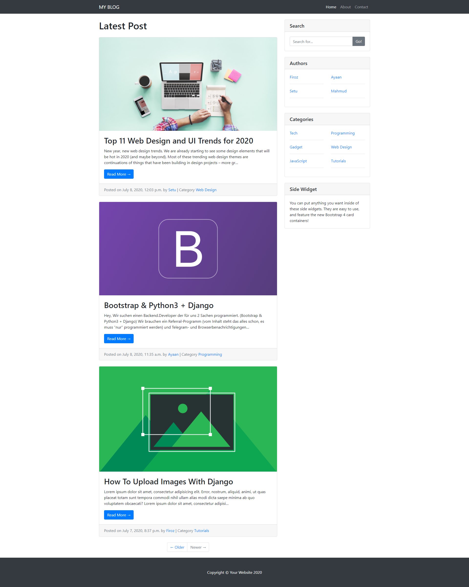
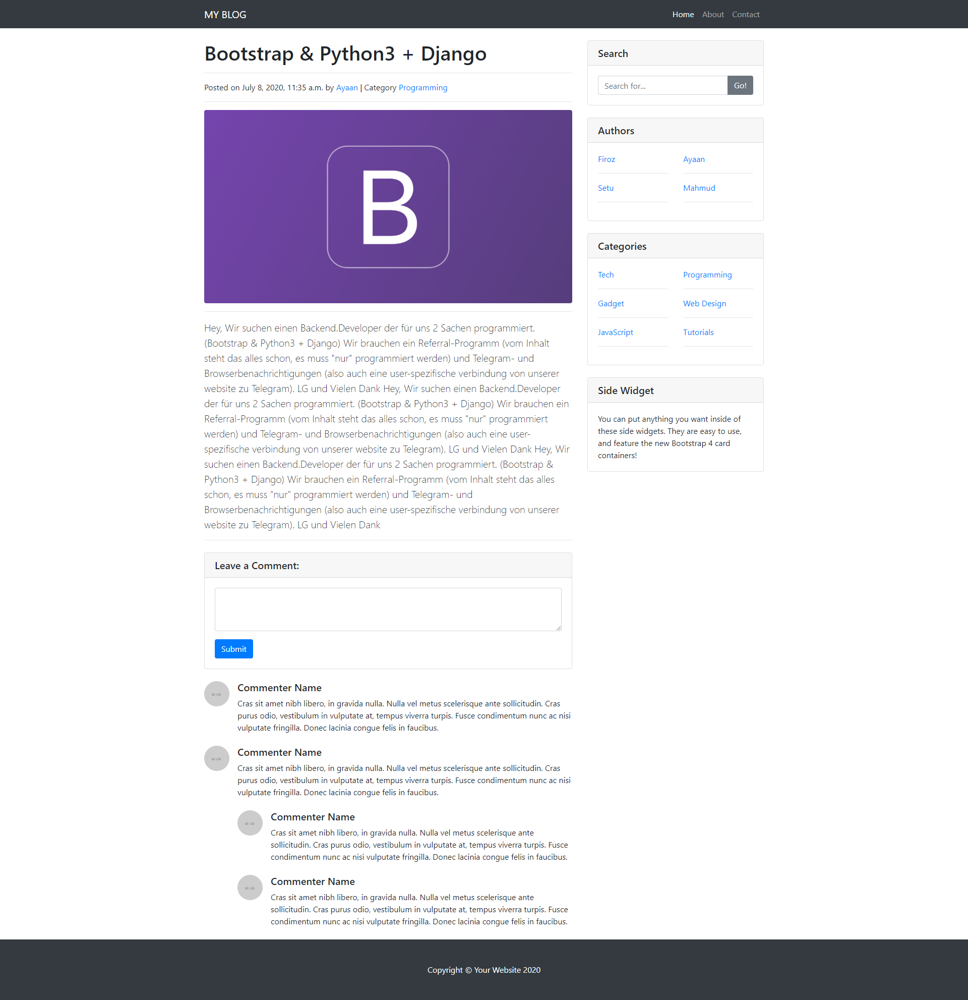
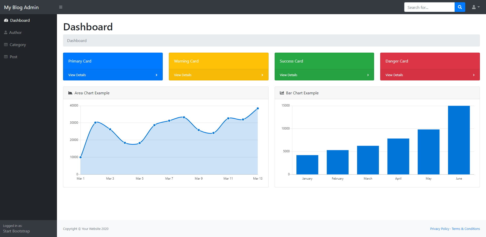

# blog_project - A Django Project For Developing An Personal Blog

`blog_project` is a main directory for Blog Project. Here included `blog_project_app`. 
`blog_project_app` is using for manage this project and here also included `blog_app` it's specially for blog app.
`blog_admin_app` this app is for custom admin.

## Features

	
Create Post

	
Upload Image

	
Set Post Author

	
Set Post Category

	
Post Filter By Author & Category

### Home Page

### Single Post Page

### Custom Admin Panel

