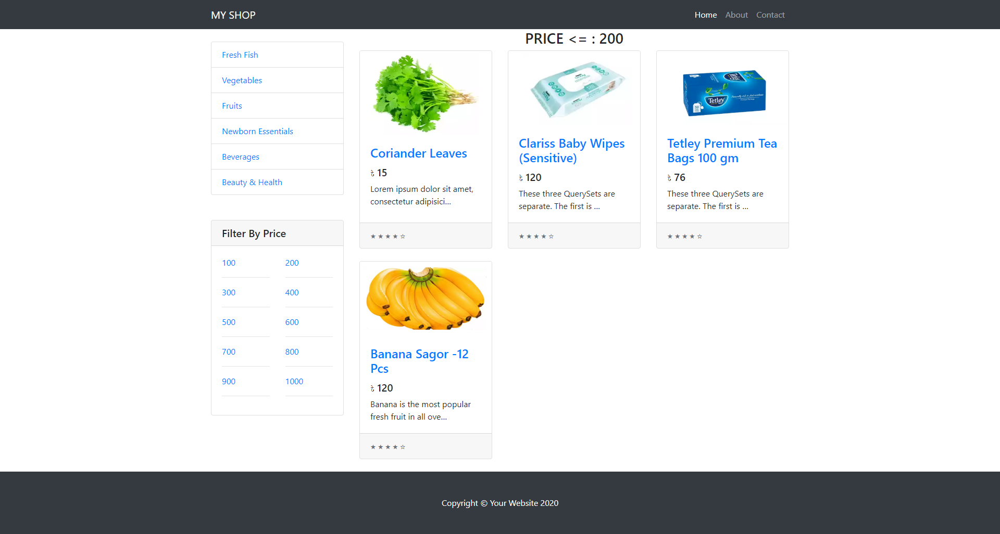

# ecom_project - A Django Project For Developing An Ecommerce Shop

`ecom_project` is a main directory for e-commerce Project. Here included `ecom_project_app`. 
`ecom_project_app` is using for manage this project and here also included `ecom_project` it's specially for ecommerce app.

## Features

	
Create Product

	
Upload Product Image

	
Set Post Category

	
Post Filter By Price Range & Category

### Home Page

### Category Page

### Price Filter Page

### Single Product Page

